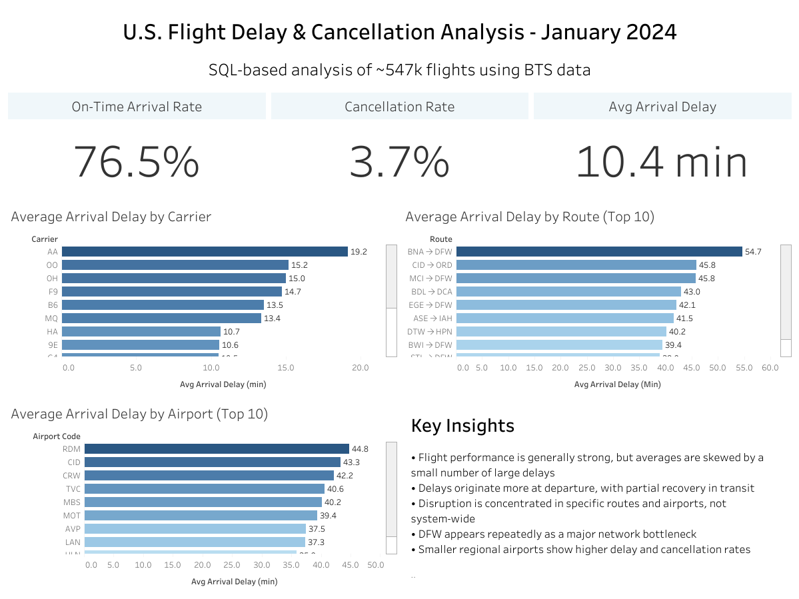

# U.S. Flight Delay & Cancellation Analysis (Jan 2024)

A SQL-first analytics project analyzing flight delays, cancellations, and operational performance across U.S. airports using Bureau of Transportation Statistics (BTS) data.

---

## Overview

This project analyzes January 2024 flight data (~547k records) to understand:

- What overall flight reliability looks like
- Which carriers, routes, and airports perform best/worst
- Where delays and cancellations are most concentrated
- How delays behave across the network (e.g., departure vs arrival)

Built to demonstrate real-world analytical thinking, KPI definition, and operational performance analysis using SQL.

---

## Executive Summary

Flight performance across U.S. airports in January 2024 is generally strong, with ~76.5% of non-cancelled flights arriving on time and a relatively low cancellation rate of ~3.7%. However, overall performance is skewed by a small number of large delays rather than widespread system failure.

Delays are primarily driven by departure disruptions, with flights recovering time in transit but not always fully. Performance varies significantly across carriers, routes, and airports, indicating that delays are concentrated rather than evenly distributed.

Specific bottlenecks—most notably Dallas/Fort Worth (DFW)—appear repeatedly across high-delay routes, suggesting network-level congestion points. Additionally, smaller regional airports exhibit higher variability and worse delay outcomes compared to major hubs.

Overall, the analysis shows that improving performance is less about system-wide changes and more about targeting high-impact routes, congested hubs, and departure operations.

---

## Visual Highlights

### Network Performance Overview (Tableau Dashboard)



> Interactive version: https://public.tableau.com/views/U_S_FlightDelayCancellationAnalysisJanuary2024/Dashboard

---

## Dashboard

- Tableau Public Dashboard:
  https://public.tableau.com/views/U_S_FlightDelayCancellationAnalysisJanuary2024/Dashboard

Interactive dashboard highlighting carrier, route, and airport performance.

---

## Tech Stack

- **PostgreSQL** – data modeling + analysis
- **SQL** – core analysis (aggregations, filtering, KPIs)
- **Tableau** – dashboard built from SQL export tables
- **VS Code + GitHub** – project workflow

---

## Dataset

- Source: BTS On-Time Performance Data
- Scope: January 2024
- ~547,000 flight records
- Key fields:
  - carrier, origin, dest
  - departure delay, arrival delay
  - cancelled, diverted

Note: Raw dataset files are not included in this repository due to size constraints. Data can be downloaded directly from the BTS source listed above.

---

## Project Structure

```
/data
  /raw
    (not included in repo due to large file size — source data available from BTS)


/sql
  /analysis
    01_explore_raw_data.sql
    02_kpi_overview.sql
    03_carrier_analysis.sql
    04_airport_analysis.sql
    05_route_analysis.sql
    06_tableau_exports.sql

  /schema
    create_schema.sql

  /staging
    create_t_ontime_reporting_raw.sql
    load_t_ontime_reporting_raw.sql

  /transforms
    create_flights_table.sql

/tableau
  dashboard.png
  /exports
    kpi_summary.csv
    carrier_performance.csv
    airport_performance.csv
    route_performance.csv

README.md
```

---

## Key Questions

- What does overall flight reliability look like?
- Which carriers perform best and worst?
- Where (routes/airports) are delays concentrated?
- Do flights recover delays in transit?

---

## Core KPIs

- On-time arrival rate
- Cancellation rate
- Avg departure delay
- Avg arrival delay

Note: Delay-based KPIs (on-time rate and average delays) are calculated using only non-cancelled flights to ensure accurate operational performance measurement.

---

## Key Findings

### 1. Overall Performance is Strong (But Skewed)

- ~76.5% of non-cancelled flights arrive on time
- ~3.7% of all flights are cancelled
- Median arrival delay is early, but averages are positive

Takeaway: A small number of large delays skew overall performance.

---

### 2. Delays Originate at Departure

- Avg departure delay: ~15.6 min
- Avg arrival delay: ~10.3 min

Takeaway: Flights often recover time in the air.

---

### 3. Carrier Performance Varies Widely

- Best: Delta (low delays + cancellations)
- Worst: American (highest delays across metrics)
- Outlier: Alaska (major cancellation spike ~17.5%)

---

### 4. Delays Are Concentrated (Not System-Wide)

Performance varies significantly by:

- route
- airport
- carrier

---

### 5. DFW is a Major Bottleneck

Multiple worst-performing routes involve Dallas/Fort Worth (DFW):

- BNA → DFW
- MCI → DFW
- STL → DFW

Takeaway: DFW acts as a network congestion point.

---

### 6. Regional Airports Struggle More

Smaller airports (e.g., MBS, TVC, AVP) show:

- higher delays
- higher cancellation rates

Takeaway: operational variability is higher outside major hubs.

---

### 7. Some Routes Consistently Underperform

Routes like:

- BNA → DFW
- CID → ORD
- BDL → DCA

appear across multiple delay metrics.

Takeaway: these are systemic issues, not random events.

---

### 8. Not All Delays Are Recovered

Example:

- BNA → DFW
  - departure: ~52 min delay
  - arrival: ~55 min delay

Takeaway: some routes worsen in transit due to downstream congestion.

---

## Methodology (Simple + Explainable)

- Load raw BTS data into PostgreSQL
- Create a clean analysis table (`warehouse.flights`)
- Define KPIs carefully (excluding cancelled flights from delay metrics)
- Build SQL queries using:
  - `GROUP BY`
  - `FILTER`
  - `HAVING COUNT(*) > 100` (to avoid small-sample noise)
- Export clean, aggregated tables for Tableau visualization

Focus: maintain consistent KPI definitions between SQL outputs and dashboard reporting.

---

## How to Review This Project Quickly

1. Read the **Executive Summary**
2. Review the **Visual Highlights (Dashboard)**
3. Skim the **Key Findings**
4. Open the **Tableau Dashboard**
5. Review SQL files for technical detail

---

## TL;DR

Flight performance is generally strong, but delays are:

- concentrated in specific routes and airports
- driven heavily by departure issues
- amplified by bottlenecks like DFW

This is a concentration problem, not a system-wide failure.

---

## Author

Spencer — Data Analyst (Portfolio Project)
